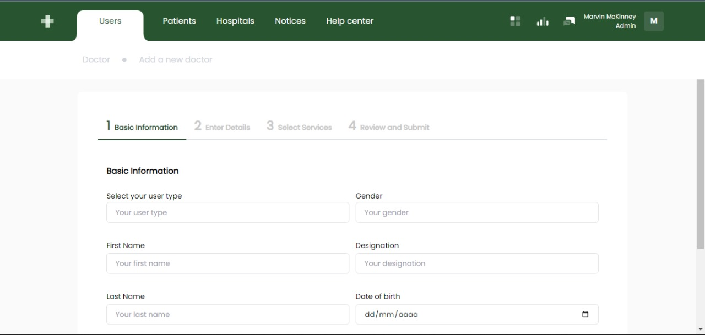
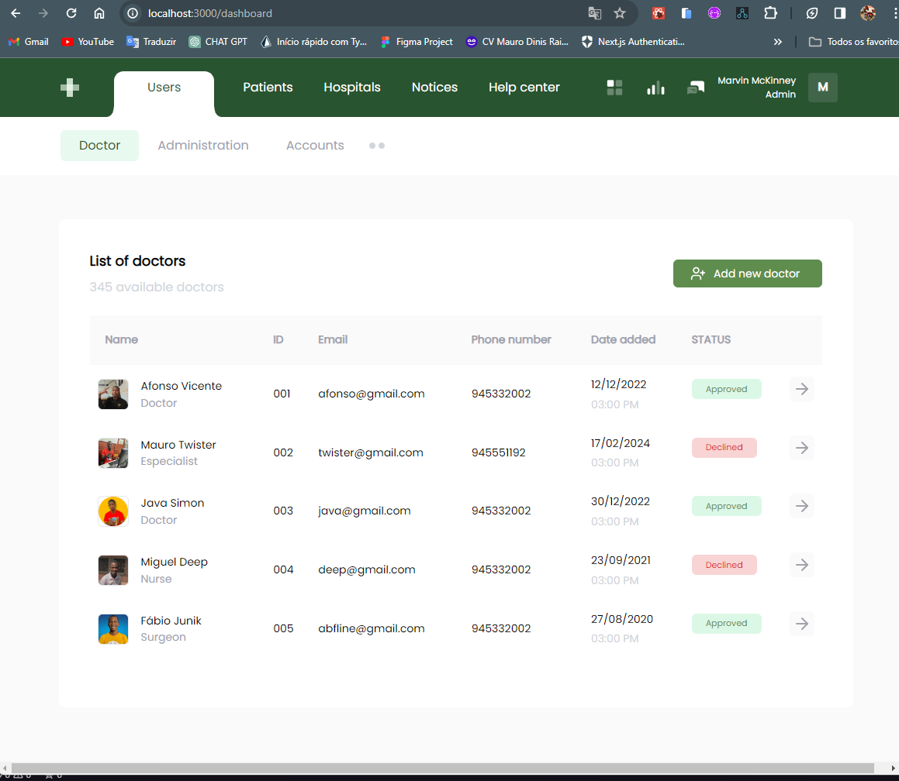

# Clínica SMAD 

### Este repositório contém o projecto `Clínica SMAD`. Um teste front-end com nextjs que fui imposto a fazer. Para mais informações sobre o projecto, clique <a href="https://github.com/MauroTwister475/test-front-end-NextJS">aqui</a>


## Imagens após a conclusão do projecto

   <div style="display:flex; flex-direction: col; flex-wrap: wrap; gap: 10px; margin-top: 50px;">
      
      
   </div>

## Técnologias Utilizadas 📌🚀 
  - [React Native](https://reactnative.dev/)
  - [Expo](https://docs.expo.dev/)
  - [Nativewind](https://nativewind.dev/)

## Requisitos para rodar o projecto:

### Setup de ambiente: 
- Node versão - <a href="https://nodejs.org/dist/v20.11.1/node-v20.11.1-x64.msi">LTS</a> >= 20
- npm (Gerenciador de pacotes que foi utilizado no projecto)

## Como rodar o projeto?👩‍💻🚩

1 - Clone o repositório

```
git clone https://github.com/MauroTwister475/test-front-end-NextJS.git
```

2 - Rode o seguinte comando para instalar todas as dependências necessárias: 
```
npm install ou npx expo install
```

3 -  E por fim, rode o seguinte comando:
```
npm start ou npx expo start
```
## Ver mais sobre mim 🔗🌎

#### Minhas Redes

- Github: https://github.com/MauroTwister475/profile
- Linkedin: https://www.linkedin.com/in/mauro-raimundo-dinis-00475526a/
